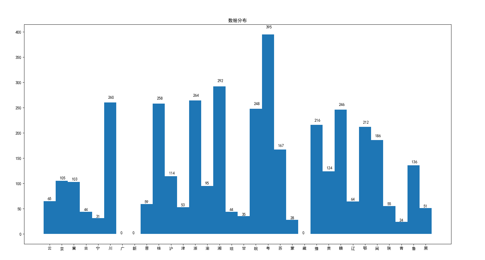
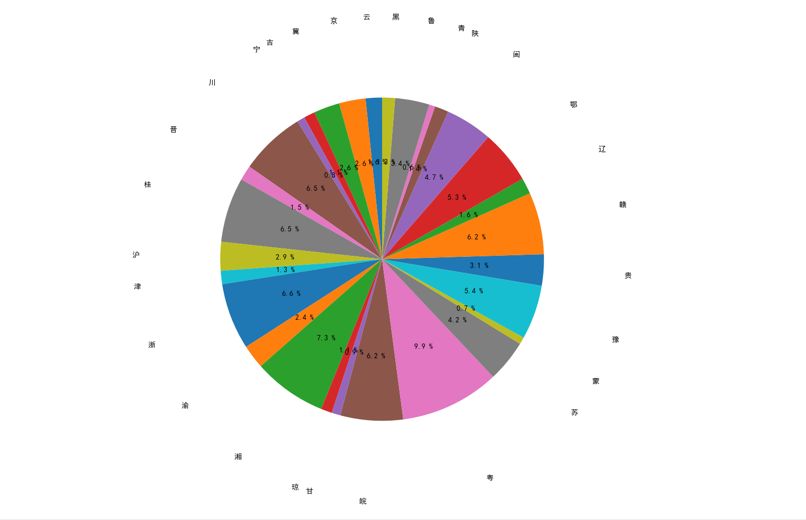

### 数据分布

**柱状图(直方图)统计各省的样本数量**

**饼状图统计各省所占比例**

训练集和验证集比例：70%， 30%

### 网络结构

采用卷积神经网络(CNN)

* 卷积层数：	2层
* 激活函数：     relu()激活函数.       ——>        tf.nn.relu()
* 优化条件：     Dropout

### 测试结果

* 正确率： 0.792373
* 召回率：
  * [云 召回率]：0.894737
    [京 召回率]：0.870968
    [冀 召回率]：0.366667
    [吉 召回率]：0.153846
    [宁 召回率]：1.000000
    [川 召回率]：0.974359
    [晋 召回率]：0.117647
    [桂 召回率]：0.974026
    [沪 召回率]：0.941176
    [津 召回率]：0.466667
    [浙 召回率]：0.936709
    [渝 召回率]：0.678571
    [湘 召回率]：0.988506
    [琼 召回率]：0.846154
    [甘 召回率]：0.909091
    [皖 召回率]：0.959459
    [粤 召回率]：0.644068
    [苏 召回率]：0.360000
    [蒙 召回率]：1.000000
    [豫 召回率]：0.984375
    [贵 召回率]：0.405405
    [赣 召回率]：0.945205
    [辽 召回率]：0.684211
    [鄂 召回率]：0.904762
    [闽 召回率]：0.690909
    [陕 召回率]：0.125000
    [青 召回率]：0.857143
    [鲁 召回率]：0.975000
    [黑 召回率]：0.133333	

