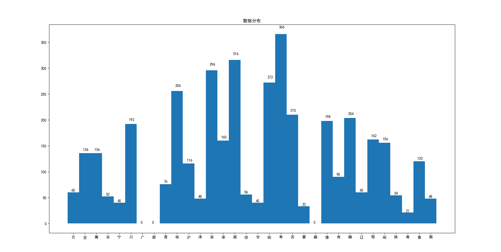
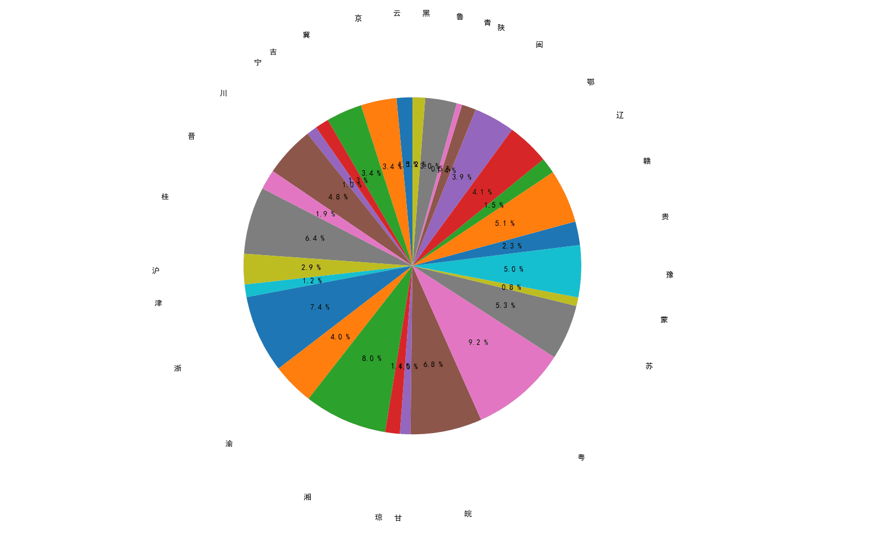

### 数据分布

**柱状图(直方图)统计各省的样本数量**

**测试集**

**饼状图统计各省所占比例**

**测试集**

训练集和验证集比例：70%， 30%

### 网络结构

采用卷积神经网络(CNN)

* 卷积层数：	2层
* 激活函数：     relu()激活函数.       ——>        tf.nn.relu()
* 优化条件：     Dropout

### 测试结果

* 正确率： 0.792373
* 召回率：  
  * [云 召回率]：0.894737  
    [京 召回率]：0.870968  
    [冀 召回率]：0.366667  
    [吉 召回率]：0.153846  
    [宁 召回率]：1.000000  
    [川 召回率]：0.974359  
    [晋 召回率]：0.117647  
    [桂 召回率]：0.974026  
    [沪 召回率]：0.941176  
    [津 召回率]：0.466667  
    [浙 召回率]：0.936709  
    [渝 召回率]：0.678571  
    [湘 召回率]：0.988506  
    [琼 召回率]：0.846154  
    [甘 召回率]：0.909091  
    [皖 召回率]：0.959459  
    [粤 召回率]：0.644068  
    [苏 召回率]：0.360000  
    [蒙 召回率]：1.000000  
    [豫 召回率]：0.984375  
    [贵 召回率]：0.405405  
    [赣 召回率]：0.945205  
    [辽 召回率]：0.684211  
    [鄂 召回率]：0.904762  
    [闽 召回率]：0.690909  
    [陕 召回率]：0.125000  
    [青 召回率]：0.857143  
    [鲁 召回率]：0.975000  
    [黑 召回率]：0.133333  	

### 最终测试结果
* 正确率： 0.863555
* 召回率： 
  * [云 召回率]：0.466667  
    [京 召回率]：0.794118  
    [冀 召回率]：0.764706  
    [吉 召回率]：0.615385  
    [宁 召回率]：0.700000  
    [川 召回率]：0.958333  
    [晋 召回率]：0.842105  
    [桂 召回率]：1.000000  
    [沪 召回率]：0.931034  
    [津 召回率]：0.083333  
    [浙 召回率]：0.770270  
    [渝 召回率]：0.500000  
    [湘 召回率]：0.987342  
    [琼 召回率]：0.357143  
    [甘 召回率]：0.900000  
    [皖 召回率]：1.000000  
    [粤 召回率]：0.919192  
    [苏 召回率]：0.957143  
    [蒙 召回率]：0.909091  
    [豫 召回率]：0.969697  
    [贵 召回率]：0.966667  
    [赣 召回率]：0.985294  
    [辽 召回率]：0.250000  
    [鄂 召回率]：1.000000  
    [闽 召回率]：0.826923  
    [陕 召回率]：0.555556  
    [青 召回率]：1.000000  
    [鲁 召回率]：0.900000  
    [黑 召回率]：0.812500  
